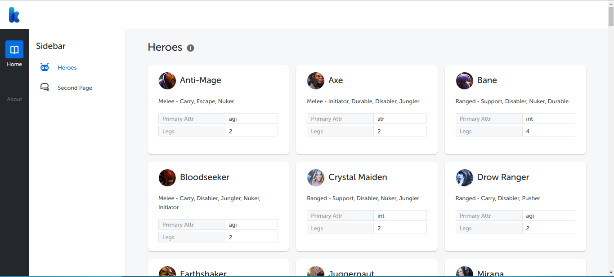

# Internal Jr Front End Kata Ai

By : Muhammad Dio Syahrizal

## The Bug

I think in the second page ('heroes/dummy') there is a bug that the dropDirection, which prefer to DropdownToggle component is not recognize as a prop. I try to find it but nothing comes to me. But as you can see the dropdown menu is still work. I appreciate if the reviewer tell me if that is a bug or that just purely my mistake.
Thank you so much, and Have a nice days :)

## Screenshot 1

## Screenshot 2

